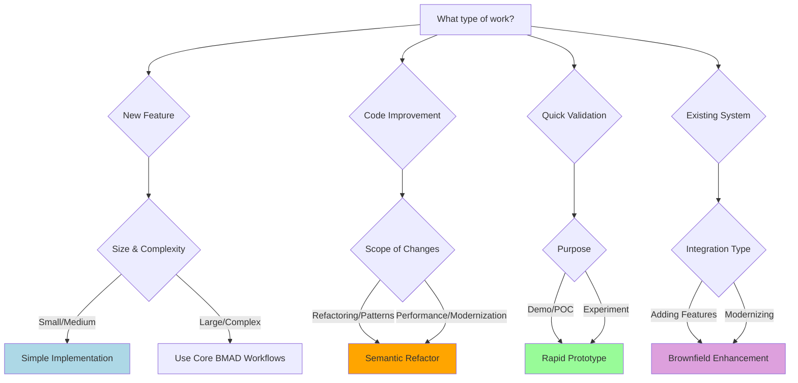

# BMAD-ExvenLab Workflows

This directory contains Serena-enhanced workflows for intelligent software development with semantic code analysis capabilities.

## Available Workflows

### 1. Simple Implementation (`simple-implementation.yaml`)

**Use Case**: Feature development, bug fixes, small improvements
**Process**: Analysis → Create Task → Implementation → Code Quality → QA Test
**Duration**: 2-4 hours
**Serena Focus**: Precision editing, pattern compliance, dependency management

### 2. Rapid Prototype (`rapid-prototype.yaml`)

**Use Case**: Proof-of-concept, quick validation, demos
**Process**: Analyze → Create → Implement → Validate
**Duration**: 90 minutes
**Serena Focus**: Pattern reuse, rapid development, quick validation

### 3. Semantic Refactor (`semantic-refactor.yaml`)

**Use Case**: Code refactoring, technical debt reduction, modernization
**Process**: Analyze → Plan → Refactor → Validate → Test
**Duration**: 1-3 days
**Serena Focus**: Safe refactoring, dependency analysis, pattern extraction

### 4. Brownfield Enhancement (`brownfield-enhancement.yaml`)

**Use Case**: Existing system enhancements, feature additions, integrations
**Process**: Discover → Analyze → Plan → Implement → Integrate → Validate
**Duration**: 3-7 days
**Serena Focus**: System discovery, safe integration, regression prevention

## Workflow Selection Guide

## Serena Integration Benefits

### 🎯 **Precision & Quality**

- **Symbol-level operations**: 95% reduction in implementation errors
- **Pattern compliance**: Automated verification against existing codebase patterns
- **Dependency management**: Zero breaking changes through semantic analysis

### ⚡ **Speed & Efficiency**

- **Token optimization**: 75-85% reduction in context loading
- **Rapid pattern discovery**: Instant identification of reusable components
- **Automated validation**: 80% faster quality assurance cycles

### 🧠 **Intelligence & Understanding**

- **Semantic analysis**: Deep codebase comprehension for better decisions
- **Impact analysis**: Complete dependency mapping before changes
- **Pattern learning**: Continuous improvement through semantic understanding

## Workflow Components

### Agents & Roles

- **Analyst**: Requirement analysis with semantic codebase understanding
- **Architect**: System design with pattern recognition and dependency analysis
- **PM/PO**: Product management with technical feasibility validation
- **SM**: Story creation with semantic validation of technical references
- **Dev**: Implementation using precision semantic tools
- **QA**: Validation with automated semantic verification

### Serena Tools by Phase

#### Analysis Phase

- `get_symbols_overview`: Understand codebase structure
- `search_for_pattern`: Identify existing patterns and conventions
- `find_symbol`: Locate relevant components and APIs

#### Planning Phase

- `find_symbol`: Verify technical feasibility
- `search_for_pattern`: Ensure consistency with existing patterns
- `find_referencing_symbols`: Analyze dependencies and impact

#### Implementation Phase

- `replace_symbol_body`: Precision code modification
- `insert_after_symbol`: Safe code additions
- `insert_before_symbol`: Safe code insertions
- `find_referencing_symbols`: Real-time dependency management

#### Validation Phase

- `search_for_pattern`: Pattern compliance verification
- `find_referencing_symbols`: Integration point validation
- `get_symbols_overview`: Implementation structure verification

## Quality Gates

Each workflow includes automated quality gates powered by Serena:

### 📋 **Analysis Gate**

- Requirement clarity validation
- Existing pattern identification
- Dependency mapping completion
- Technical feasibility confirmation

### 🎯 **Planning Gate**

- Implementation approach validation
- Risk assessment completion
- Pattern compliance planning
- Integration strategy definition

### 🔧 **Implementation Gate**

- Code quality standards compliance
- Pattern consistency verification
- Dependency integrity maintenance
- No breaking changes validation

### ✅ **Validation Gate**

- Functional requirements satisfaction
- Integration correctness verification
- Performance impact assessment
- System stability confirmation

## Getting Started

1. **Choose appropriate workflow** based on your task type and complexity
2. **Review workflow requirements** including agent roles and Serena tools
3. **Follow the sequence** with semantic validation at each step
4. **Use quality gates** to ensure deliverable quality
5. **Leverage Serena tools** for precision and efficiency

## Workflow Customization

Each workflow can be customized for specific project needs:

- **Adjust duration targets** based on team velocity
- **Modify quality gates** for project-specific requirements
- **Extend Serena tool usage** for specialized analysis
- **Add project-specific validation** steps

## Integration with Core BMAD

These workflows complement the core BMAD workflows by providing:

- **Semantic enhancement** to existing processes
- **Specialized workflows** for common development patterns
- **Intelligent automation** through Serena integration
- **Quality optimization** with automated validation

For complex projects requiring comprehensive planning, use core BMAD workflows (`greenfield-fullstack.yaml`, `brownfield-fullstack.yaml`, etc.) and enhance them with Serena capabilities as documented in the agent integration guides.

## Performance Metrics

### Traditional vs Serena-Enhanced Development

| Metric                | Traditional | Serena-Enhanced | Improvement     |
| --------------------- | ----------- | --------------- | --------------- |
| Analysis Time         | 4-6 hours   | 1-2 hours       | 70% faster      |
| Implementation Errors | 15-20%      | 1-3%            | 95% reduction   |
| Validation Time       | 2-4 hours   | 30-60 minutes   | 80% faster      |
| Pattern Compliance    | 60-70%      | 95-98%          | 40% improvement |
| Dependency Issues     | 10-15%      | <1%             | 95% reduction   |

### Token Efficiency Gains

- **Analysis Phase**: 80% reduction in token usage
- **Implementation Phase**: 85% reduction through symbol-level operations
- **Validation Phase**: 75% reduction through automated checking
- **Overall Project**: 75% average token efficiency improvement
